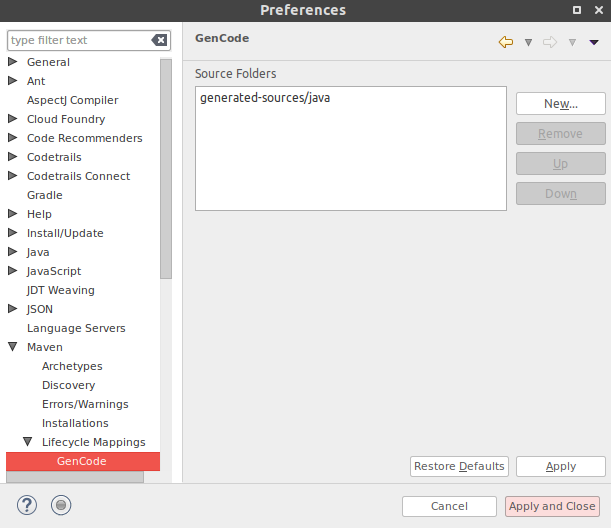

# GenCode-M2E-Connector
M2E connector that can be configured to connect generated source directories which result of maven plug-in which doesn't have m2e connectors. 

By default this connector is mapped with maven `maven-resources-plugin:resources`plug-in. So if you have any maven plug-in which doesn't have a m2e connector, you will need to run the maven build once and then update the maven project configuration in eclipse IDE which will connect the generated source directories.

## Features

- Source folder configuration 

  

## Update site
Stable and Nightly update sites
### Stable

Coming soon

### Nightly
[https://dl.bintray.com/gayanper/p2/gencode-m2e-connector/nightly/](https://dl.bintray.com/gayanper/p2/gencode-m2e-connector/nightly/)

